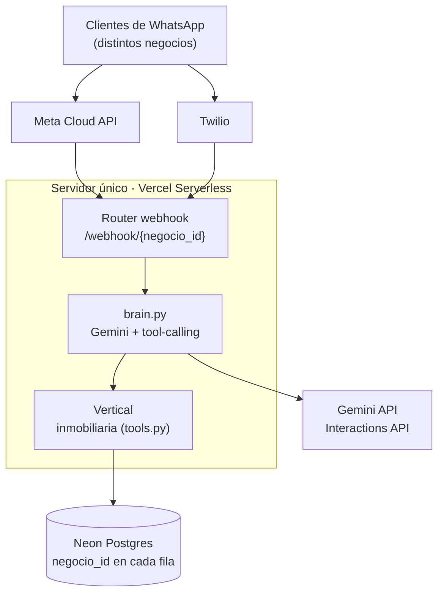

# AgentKit SaaS — Modo Multi-Tenant

Versión del sistema pensada para atender **muchos clientes desde un solo
servidor y una sola base de datos**, en vez de un deploy de Railway por
cliente. Pensala como la evolución natural de `examples/inmobiliaria/`
cuando ese modelo (un repo, un deploy, una DB por negocio) deja de ser
manejable operativamente — a partir de ahí, cada actualización de código
hay que replicarla N veces, y cada Railway cuesta aparte.

## Arquitectura



La URL del webhook (`/webhook/{negocio_id}`) es lo único que identifica al
cliente — a partir de ahí, credenciales, system prompt, catálogo y vertical
se resuelven contra esa fila de `negocios`, nunca contra variables de
proceso globales.

## Qué cambia respecto al modo single-tenant

| | Single-tenant (`examples/inmobiliaria`) | Multi-tenant (acá) |
|---|---|---|
| Deploy | Uno por cliente | Uno para todos |
| Base de datos | Una por cliente | Una compartida, aislada por `negocio_id` |
| Config del negocio | Archivos YAML (`business.yaml`, `prompts.yaml`) | Fila en la tabla `negocios` |
| Catálogo | `config/propiedades.yaml` | Tabla `propiedades` con `negocio_id` |
| URL de webhook | `/webhook` (una por deploy) | `/webhook/{negocio_id}` (una por cliente, mismo servidor) |
| Credenciales WhatsApp | `.env` del proceso | Columnas en la fila de `negocios` |
| Agregar un negocio | Clonar el repo, `/build-agent` de nuevo, deployar | Un comando: `scripts/alta_negocio.py` |
| Agregar código nuevo (ej. una tool) | Hay que tocar cada repo de cada cliente | Se toca una vez, aplica a todos los que usan esa vertical |

**Lo que NO cambia:** la lógica de negocio. `agent/verticals/inmobiliaria/tools.py`
es prácticamente el mismo `agent/tools.py` de `examples/inmobiliaria/`, solo que
ahora recibe `negocio_id` además de `telefono` para no cruzar datos entre clientes.

## Cómo aislar los datos de cada cliente

No hay una base de datos por cliente — hay una sola, y **toda** tabla que
guarda algo de un negocio (`Mensaje`, `Lead`, `Visita`, `Propiedad`,
`EventoWebhook`) tiene una columna `negocio_id`, y **toda** query pasa por
`WHERE negocio_id = ...` (ver `agent/memory.py`). El punto de entrada que
determina de qué negocio es cada request es la URL del webhook —
`/webhook/{negocio_id}` — no algo que se infiera del contenido del mensaje.

## Probar en local

```bash
cd examples/saas-multitenant
python -m venv .venv && source .venv/bin/activate   # o .venv\Scripts\activate en Windows
pip install -r requirements.txt
cp .env.example .env
# Editá .env y poné tu GEMINI_API_KEY (gratis en aistudio.google.com/apikey)
```

Dar de alta un negocio de prueba, reutilizando el `prompts.yaml` y
`propiedades.yaml` que ya existen en `examples/inmobiliaria/`:

```bash
python scripts/alta_negocio.py \
  --id vista-real \
  --nombre "Vista Real Inmobiliaria" \
  --vertical inmobiliaria \
  --prompt-file ../inmobiliaria/config/prompts.yaml \
  --propiedades ../inmobiliaria/config/propiedades.yaml \
  --provider meta \
  --meta-token EAAxxxxx \
  --meta-phone-id 1234567890 \
  --meta-verify-token "algo-secreto" \
  --meta-app-secret "xxxxxxxx"
```

(las credenciales pueden ser cualquier placeholder para probar solo
`test_local.py`, que no llega a llamar `enviar_mensaje`. Si preferís
Twilio para el sandbox de prueba, `--provider twilio --twilio-sid ...
--twilio-token ... --twilio-numero ...` funciona igual.)

Probar el chat:

```bash
python tests/test_local.py
# ID del negocio a probar: vista-real
```

Dar de alta un SEGUNDO negocio (otro rubro, cuando exista, u otra
inmobiliaria con otro catálogo) y confirmar que sus datos no se mezclan
con el primero — es la prueba que realmente importa en un sistema
multi-tenant.

## Llevarlo a producción gratis (Vercel + Neon + Meta)

Esta combinación puede dejar el proyecto corriendo en $0: Gemini tiene tier
gratis real (sin tarjeta), y sumado a Vercel + Neon + Meta cubrís infra y
mensajería sin costo mientras el volumen se mantenga dentro de esos límites:

1. **Base de datos — [Neon](https://neon.tech) (Postgres serverless, free tier):**
   creá un proyecto, copiá la connection string **pooled** (con `-pooler` en
   el host — serverless abre/cierra conexiones seguido, sin pooling se
   agotan) y usala como `DATABASE_URL` con el prefijo `postgresql+asyncpg://`.

   Antes del primer deploy, corré esto una vez contra esa base para crear
   las tablas (en Vercel el `lifespan` de FastAPI no es un lugar confiable
   para correr esto en cada cold start):
   ```bash
   python -c "import asyncio; from agent.db import inicializar_db; asyncio.run(inicializar_db())"
   ```

2. **Hosting — [Vercel](https://vercel.com) (free tier, Serverless Functions):**
   este proyecto ya trae `api/index.py` + `vercel.json` para deployarlo tal
   cual. Al importar el repo en Vercel, configurá el **Root Directory** en
   `examples/saas-multitenant`, y cargá las env vars (`GEMINI_API_KEY`,
   `DATABASE_URL`, `GEMINI_MODEL`).

   **Importante:** el plan Hobby (gratis) de Vercel prohíbe uso comercial en
   sus términos de servicio. Sirve mientras estás probando o no le cobrás
   todavía a ningún cliente. En cuanto factures con esto, pasate al plan Pro
   (US$20/mes) — igual sigue siendo barato comparado con un deploy por
   cliente en Railway.

3. **WhatsApp — Meta Cloud API (no Twilio) para minimizar costo:** desde
   2025 las conversaciones iniciadas por el cliente son gratis e ilimitadas
   en Meta. Como este agente solo responde (nunca manda plantillas de
   marketing), el costo de mensajería en producción puede ser $0. Twilio
   sigue sirviendo para el sandbox de prueba inicial (cero fricción, no
   requiere Business verificado), pero para producción real conviene migrar
   cada negocio a Meta:
   ```bash
   python scripts/alta_negocio.py \
     --id vista-real --nombre "Vista Real Inmobiliaria" --vertical inmobiliaria \
     --prompt-file ../inmobiliaria/config/prompts.yaml \
     --propiedades ../inmobiliaria/config/propiedades.yaml \
     --provider meta \
     --meta-token EAAxxxxx --meta-phone-id 1234567890 \
     --meta-verify-token "algo-secreto" --meta-app-secret "xxxxxxxx"
   ```
   Por cada cliente nuevo: `scripts/alta_negocio.py` contra la base de
   producción, y le pasás la URL `https://tu-proyecto.vercel.app/webhook/{id}`
   para que la configure como Callback URL en su app de Meta.

4. **Gemini API:** el tier gratis (sin tarjeta) alcanza ~10-15 solicitudes
   por minuto y 250-1.000 por día según el modelo — suficiente para probar
   y para varios negocios chicos. Si el volumen crece más que eso, Gemini
   pasa a facturar por uso (mucho más barato que no tener nada gratis desde
   el arranque). Verificá tus límites actuales en
   [aistudio.google.com](https://aistudio.google.com), que cambian seguido.

5. **Meta App Review**: si vas a dar de alta varios clientes con Meta, en
   algún momento te conviene el programa "Tech Provider" de Meta en vez de
   que cada cliente traiga su propia app de Facebook — investigalo antes de
   prometerle Meta a más de 2-3 clientes, el onboarding oficial multi-cliente
   es más burocrático que Twilio.

**Alternativa sin serverless:** si preferís un servidor siempre-vivo en vez
de funciones (por ejemplo si el cold start de Vercel te preocupa para
webhooks), el `Dockerfile`/`docker-compose.yml` de este mismo proyecto
sirven tal cual en Koyeb o Render (ambos con free tier, aunque con un
"sleep" tras inactividad que Vercel no tiene).

## Agregar un rubro nuevo (además de inmobiliaria)

1. Creás `agent/verticals/<rubro>/tools.py` con el mismo contrato
   (`TOOLS` + `EJECUTAR_TOOL`, funciones que reciben `telefono` y
   `negocio_id`)
2. Lo registrás en `agent/verticals/__init__.py`
3. Al dar de alta un negocio con `--vertical <rubro>`, ya puede usarlo

Ningún otro archivo (`main.py`, `brain.py`, `memory.py`) se toca.
